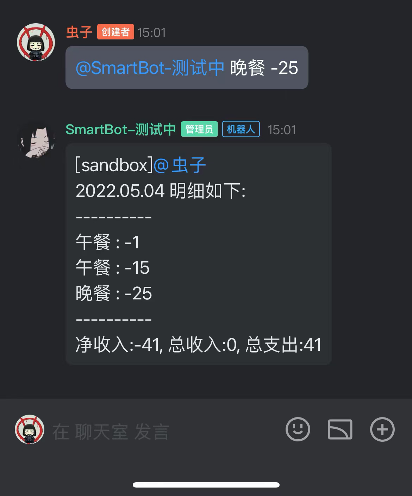

# QQ频道记账机器人
## 源码地址

https://github.com/Xer97/xer97-qq-bot

## 体验二维码

## 使用说明

1、扫码进入频道-聊天室

2、@SmartBot-测试中

3、根据机器人提示信息进行记账交互

（1）@SmartBot-测试中，然后输入“事项 金额”进行当天收支事项的记录，记录成功后会回复当天收支明细

（2）@SmartBot-测试中，然后输入“日期”（如：2022.05.04）查询指定日期的收支明细

## 方案设计

### 整体设计

方案分为**接口交互层**和**逻辑实现层**

### 接口交互层

接口交互层主要功能是控制机器人与服务器间的通信、接收与处理事件

具体实现：

- 使用 websocket 进行长连接通信，定时维护心跳
- 监听 websocket 消息，解析事件信息，执行事件分发

### 逻辑实现层

逻辑实现层主要功能是实现记账的功能逻辑

具体实现：

- 解析@消息，得出操作指令，根据空格切分字符串
  - 结果为两个字符串则为“记录收支信息”
  - 结果为一个字符串则为“输出指定日期明细”
- 根据指令执行对应记账逻辑（记账信息按用户纬度记录，本次实现方式为内存存储，机器人重启后数据会丢失，真正逻辑下需使用数据库存储）
- 异常处理：若输入格式不正确，则返回完整功能提示

